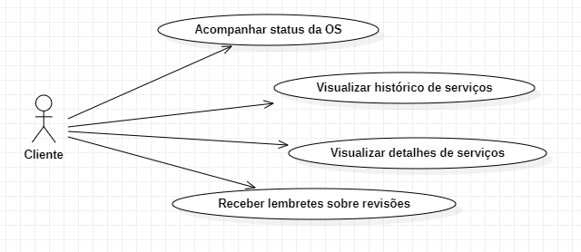
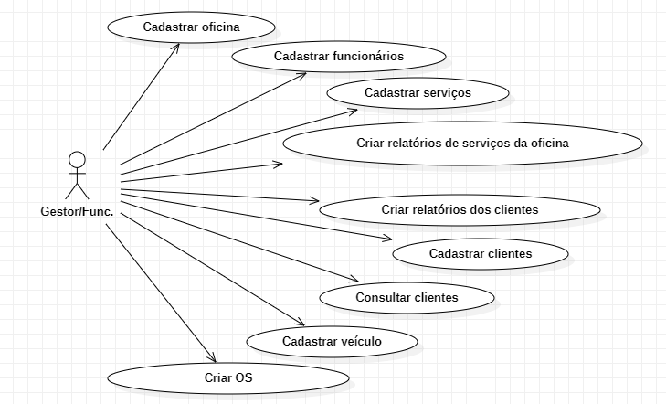

# Especificações do Projeto

Pré-requisitos: <a href="1-Documentação de Contexto.md"> Documentação de Contexto</a>

A determinação exata do problema, suas personas, requisitos funcionais e não-funcionais foram acordadas em reuniões online entre os membros da equipe. Foram reunidas informações e observações dos membros sobre aspectos relevantes na relação de clientes e oficinas, buscando entender as necessidades, insatisfações e sucessos de todas as partes envolvidas. Os detalhes levantados nesse processo auxiliaram na construção de personas e histórias de usuários mais completas e úteis para o projeto a ser desenvolvido.

## Personas

| Jade Miranda | Gaspar Rocha | Ênio Braga |
| ---        |    ----   |          --- |
|      |        |  |
| Idade: 44 anos  Ocupação: Gerente de Oficina Automobilística| Idade: 26 anos  Ocupação: Representante comercial       | Idade: 34 anos  Ocupação: Mecânico |
| Hobbies, História: <ul><li>Assistir séries</li><li>Praticar Muay-Thai</li></ul> | Hobbies, História: <ul><li>Jogar RPG de mesa</li><li>Fazer trilhas</li></ul>  | Hobbies, História: <ul><li>Tocar violão</li><li>Jogar Video game</li></ul> |
| Motivações:  <ul><li>Conseguir dar _feedbacks_ mais rápidos e precisos a clientes</li><li> Manter um bom equilíbrio entre trabalho e vida pessoal</li><li> Fidelizar clientes com a qualidade do atendimento</li></ul> | Motivações:  <ul><li>Poder viajar pelo estado em finais de semana e feriados</li><li>Uma rotina de trabalho equilibrada</li></ul>           | Motivações:  <ul><li>Se especializar no conserto de carros antigos</li><li>Conseguir maior flexibilidade no trabalho</li></ul>   |
| Frustrações:  <ul><li>Não conseguir organizar bem a jornada de trabalho e serviços pendentes</li><li>Não ter um canal de comunicação mais eficiente com clientes</li><li>Não fidelizar a quantidade de clientes que considera possível com a oficina </li></ul> | Frustrações:  <ul><li>Nunca lembrar de manutenções e ter problemas com o carro por causa disso</li><li>Não ter uma oficina de sua confiança</li><li>Não poder viajar de carro sempre que quiser</li></ul> | Frustrações:   <ul><li>Dificuldade de compartilhar informações sobre com agilidade serviços entre colegas e com a gerência</li><li> Não ter um bom canal de comunicação sobre a fila de serviços a serem feitos na oficina</li><li>Não conseguir atualizar a gerÊncia e os clientes sobre problemas emergentes com rapidez</li></ul>  |

## Histórias de Usuários

Com base na análise das personas foram identificadas as seguintes histórias de usuários:

|EU COMO... `PERSONA`| QUERO/PRECISO ... `FUNCIONALIDADE`                                                                       |PARA ... `MOTIVO/VALOR`                                                                        |
|--------------------|----------------------------------------------------------------------------------------------------------|-----------------------------------------------|
|Funcionário da oficina |Efetuar o cadastro, alteração e exclusão de oficinas no sistema |Que a gestão da oficina matriz e das oficinas filiais seja realizada de forma centralizada em um único sistema|
|Funcionário da oficina | Efetuar o cadastro, alteração e exclusão de funcionários no sistema |Conseguir realizar a gestão dos meus funcionários de maneira facilitada|
|Funcionário da oficina | Efetuar o cadastro, alteração e exclusão dos serviços disponibilizados pela oficina |Que seja possível incluir, alterar e excluir informações de um determinado serviço|
|Funcionário da oficina| Efetuar o cadastro, alteração e exclusão de clientes no sistema| Que seja possível incluir e alterar informações de um determinado cliente|
|Funcionário da oficina| Consultar os clientes cadastrados no sistema| Conseguir realizar a gestão dos clientes de maneira otimizada|      
|Funcionário da oficina |Realizar o cadastro de veículo (s) para um determinado cliente no sistema| Conseguir realizar a inclusão dos serviços solicitados para o veículo|
|Funcionário da oficina| Inserir, alterar e excluir informações sobre o andamento de um determinado serviço no sistema| Que o registro dessas informações esteja sempre atualizado|
|Cliente da oficina| Acompanhar o andamento do serviço solicitado à oficina e a data prevista para finalização| Que eu tenha informações relevantes sobre a evolução do serviço contratado|
|Cliente da oficina| Visualizar o histórico de serviços efetuados/concluídos no (s) meu (s) veículo (s) nos últimos 5 anos| Que eu consiga consultar os registros de forma fácil e centralizada em um único sistema|  
|Cliente da oficina| Visualizar no detalhamento do serviço informações como: peças trocadas, serviços efetuados, mecânico responsável e valores das peças e serviços |Que eu consiga consultar informações relevantes sobre os serviços que foram efetuados no (s) meu (s) veículo (s)|
|Cliente da oficina |Receber lembretes automáticos sobre revisões e serviços recomendados para o (s) meu (s) veículo (s) |Que eu seja lembrado de realizar serviços importantes para a correta manutenção do (s) meu (s) veículo (s)|

## Modelagem do Processo de Negócio 

### Análise da Situação Atual

Apresente aqui os problemas existentes que viabilizam sua proposta. Apresente o modelo do sistema como ele funciona hoje. Caso sua proposta seja inovadora e não existam processos claramente definidos, apresente como as tarefas que o seu sistema pretende implementar são executadas atualmente, mesmo que não se utilize tecnologia computacional. 

### Descrição Geral da Proposta

Apresente aqui uma descrição da sua proposta abordando seus limites e suas ligações com as estratégias e objetivos do negócio. Apresente aqui as oportunidades de melhorias.

### BPMN
https://github.com/ICEI-PUC-Minas-PMV-ADS/pmv-ads-2023-1-e4-proj-apdist-t4-crm_auto/blob/main/docs/bpmn/diagram.svg

## Cadastro de usuário e veículo

##Login Usuário

## Cadastro/Edição oficina

## Consultar cliente

## Criar/Editar OS

## Emissão de lembretes

## Indicadores de Desempenho

Apresente aqui os principais indicadores de desempenho e algumas metas para o processo. Atenção: as informações necessárias para gerar os indicadores devem estar contempladas no diagrama de classe. Colocar no mínimo 5 indicadores. 

Usar o seguinte modelo: 

Obs.: todas as informações para gerar os indicadores devem estar no diagrama de classe a ser apresentado a posteriori. 

## Requisitos

As tabelas que se seguem apresentam os requisitos funcionais e não funcionais que detalham o escopo do projeto. Para determinar a prioridade de requisitos, aplicar uma técnica de priorização de requisitos e detalhar como a técnica foi aplicada.

### Requisitos Funcionais

As tabelas que a seguir apresentam os requisitos funcionais e não funcionais que detalham o escopo do projeto.

### Requisitos Funcionais

| ID    | Descrição do Requisito | PRIORIDADE |
|-------|---|---|
| RF-01 | O sistema deve permitir que os usuários façam cadastro e login. | ALTA |
| RF-02 | O sistema deve permitir que o cliente consulte os serviços através de uma aplicação mobile. | ALTA |
| RF-03 | O sistema deve permitir a inserção, edição e exclusão de registros da oficina. | ALTA |
| RF-04 | O sistema deve permitir a inserção, edição e exclusão de um novo serviço disponibilizado pela oficina. | ALTA |
| RF-05 | O sistema deve permitir a consulta dos clientes cadastrados. | MÉDIO |
| RF-06 | O sistema deve permitir a inserção, edição e exclusão de veículo(s) para o cliente. | BAIXO |
| RF-07 | O sistema deve permitir o acompanhamento do andamento de um serviço pelo cliente e a data prevista para finalização. | ALTA |
| RF-08 | O sistema deve emitir lembretes para os clientes após 11 meses desde a última revisão anual. | BAIXA |
| RF-09 | O sistema deve permitir a inserção de uma nova ordem de serviço. | ALTA |
| RF-10 | O sistema deve permitir a edição e exclusão de serviços de uma ordens de serviço em andamento. | ALTA |

### Requisitos não Funcionais

| ID  | Descrição do Requisito | PRIORIDADE |
|--------|---|---|
| RNF-01 | O sistema deve ser implementado utilizando as tecnologias C#, JavaScript, HTML e CSS. | ALTA |
| RNF-02 | A persistência dos dados será feita no banco MONGO, arquitetura NOSQL e estrutura de arquivos JSON. | ALTA |
| RNF-03 | O sistema deve ser responsivo para rodar no navegador de um dispositivos móvel. | ALTA |
| RNF-04 | O projeto de software, para a plataforma web, será desenvolvido utilizando o padrão arquitetutal MVC (Model-View-Controller). | ALTA |
| RNF-05 | O projeto de software, para a plataforma mobile, será desenvolvido utilizando o REACT NATIVE | ALTA |

## Restrições

O projeto está restrito pelos itens apresentados na tabela a seguir.

|ID| Restrição                                             |
|--|-------------------------------------------------------|
| RE-01 | O projeto deverá ser entregue até a data de 25/06/2023 |

## Diagrama de Casos de Uso

## Matriz de Rastreabilidade de Requisitos
Atualmente, observando os requisitos que foram levantados a matriz de rastreabilidade foi elaborada de forma a permitir aos profissionais a visualização da correlação entre os requisitos de software.

# Matriz de Rastreabilidade

Atualmente, observando os requisitos que foram levantados a matriz de rastreabilidade foi elaborada de forma a permitir aos profissionais a visualização da correlação entre os requisitos de software.

[Matriz de Rastreabilidade - CRM Auto.xlsx](https://github.com/Jcblustosa/crm-auto/files/10865661/Matriz.de.Rastreabilidade.-.CRM.Auto.xlsx)

# Gerenciamento de Projeto

De acordo com o PMBoK v6 as dez áreas que constituem os pilares para gerenciar projetos, e que caracterizam a multidisciplinaridade envolvida, são: Integração, Escopo, Cronograma (Tempo), Custos, Qualidade, Recursos, Comunicações, Riscos, Aquisições, Partes Interessadas. Para desenvolver projetos um profissional deve se preocupar em gerenciar todas essas dez áreas. Elas se complementam e se relacionam, de tal forma que não se deve apenas examinar uma área de forma estanque. É preciso considerar, por exemplo, que as áreas de Escopo, Cronograma e Custos estão muito relacionadas. Assim, se eu amplio o escopo de um projeto eu posso afetar seu cronograma e seus custos.

## Gerenciamento de Tempo

[Gerenciamento de Projeto - Tempo.xlsx](https://github.com/Jcblustosa/crm-auto/files/10798615/Gerenciamento.de.Projeto.-.Tempo.xlsx)

## Gerenciamento de Equipe

 O gerenciamento apropriado de tarefas contribuirá para que o projeto tenha um bom nível de produtividade. É fundamental que ocorra a gestão de tarefas e de pessoas, para que os profissionais envolvidos no projeto possam ser facilmente gerenciados.

Membros do time: André, Júlio, Mislene, Bruna, Arthur e Maxwell

Gerente de Projeto: Júlio
Designer: Mislene
Analista de Sistemas:Maxwell
Arquiteta de Software:Bruna, Arthur
Desenvolvedores:André, Júlio, Mislene, Bruna, Arthur e Maxwell
Analista de Banco de Dados:Júlio, André
Analista de Testes:Mislene, Bruna

## Gestão de Orçamento

Os valores dos custos do projeto foram calculados com a estimativa de tempo de quatro meses, utilizando seis profissionais. Qualquer alteração de custos que ultrapassar a estimativa da linha de base deverá ser avaliada pelo cliente e gerente do projeto.

| Recursos Necessários | Valor         |
| -------------------- | ------------- |
| Recursos Humanos     | R$ 150.000,00 |
| Software             | R$ 480,00     |
| Serviços             | R$ 1.200,00   |
| Total                | R$ 151.680,00 |

Cálculo:

Recursos Humanos = 6 Profissionais x R$ 60,00/hora x 416 horas (4 meses) = R$ 150.000,00

Softwares = 6 locações (windows, office) x R$ 20,00/Mês x 4 Meses = R$ 480,00

Serviços = 6 despesas (energia, hospedagem) x R$ 50,00/Mês x 4 Meses = R$ 1.200,00.

